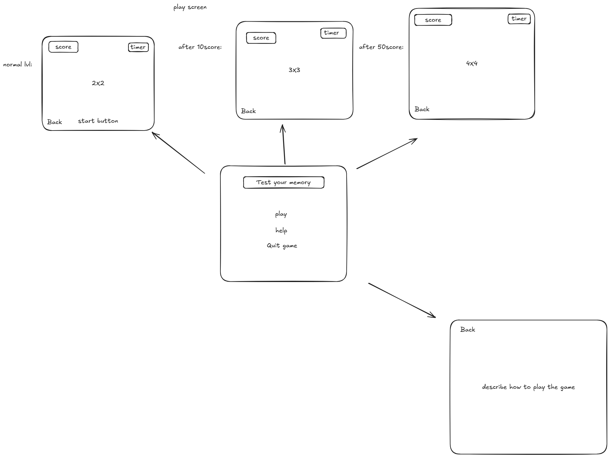

# Project plan - README

---

## Project Title

Test-Your-Memory

---

## Project Description

This game test your memory limits

---

## Wire frames

---

## Pseudo code

### The (main)

page include (des)description,thats name Help , play to enter the game ,and Quit game to quit.
I will use for main getElementById and addEventListener to move bettween them.Last, for Quit I learn How to close the page using (window.location.href = "goodbye.html").

### play

The game include 3 main things : 1-score 2-timer 3-boxPictures.

---

#### score :

for score I need for loop ,and if condition to increase the score ,and variable called ifPLayerWin ,and score. maybe I will use function.

---

#### timer

For timer I need variable called Timer and TimeSpeed .Also, I will use function to control the speed of the timer , resetTimer to rest the time ,and decTimer to decrease the time ,and more....

---

#### boxPictures

I need array to set up the game.variable for the img , win , and hidePic. function to increase the size of the array ,and using sort() and math.random() to change the place of img , hide to hide the picture ,and more....

---

### Help

just html p to describe and button click Back.
